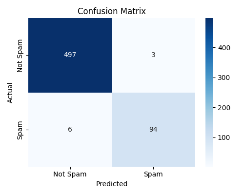
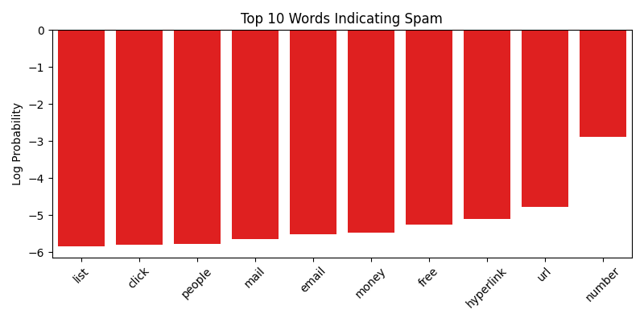
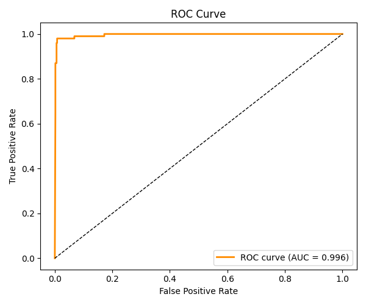

# Spam Classifier using Naive Bayes

## Project Overview
This project implements a **Spam Email Classifier** using a Naive Bayes algorithm with a **bag-of-words model**. It predicts whether an email is **Spam** or **Not Spam** based on the content of the email.

The dataset consists of **raw email text** from the [Apache SpamAssassin Public Corpus](https://spamassassin.apache.org/old/publiccorpus/).

---

## Dataset

- Apache SpamAssassin Public Corpus:
  - **Ham emails**: 2,500  
  - **Spam emails**: 500  
- Dataset CSV contains **2 columns**:  
  - `email` → raw email text  
  - `label` → 1 = Spam, 0 = Not Spam  
- All numbers and URLs in emails were replaced with `NUMBER` and `URL` tokens to reduce noise.

---

## Features & Preprocessing

- **Bag-of-words (unigram) model** using `CountVectorizer`  
- Stopwords removed (`stop_words='english'`)  
- Preprocessing:  
  - Numbers → `NUMBER`  
  - URLs → `URL`  
- Train-test split: 80% train / 20% test  

---

## Model

- **Algorithm**: Multinomial Naive Bayes (`MultinomialNB`)  
- **Evaluation metrics**:
  - Accuracy
  - Precision, Recall, F1-score
  - Confusion matrix
  - ROC curve & AUC score
  - 5-Fold Cross-Validation

---

## Results

### Performance Metrics

| Metric        | Score |
|---------------|-------|
| Accuracy      | 0.985 |
| Spam Recall   | 0.94  |
| AUC Score     | 0.996 |
| CV Accuracy   | 0.989 ± 0.0023 |

### Confusion Matrix

- True Negatives: 497  
- False Positives: 3  
- False Negatives: 6  
- True Positives: 94

### Top 10 Words Indicating Spam

`['list', 'click', 'people', 'mail', 'email', 'money', 'free', 'hyperlink', 'url', 'number']`

### ROC Curve

---

## How to Run

1. Clone this repository  
2. Install dependencies:
   pip install -r requirements.txt
3. python main.py or py main.py
